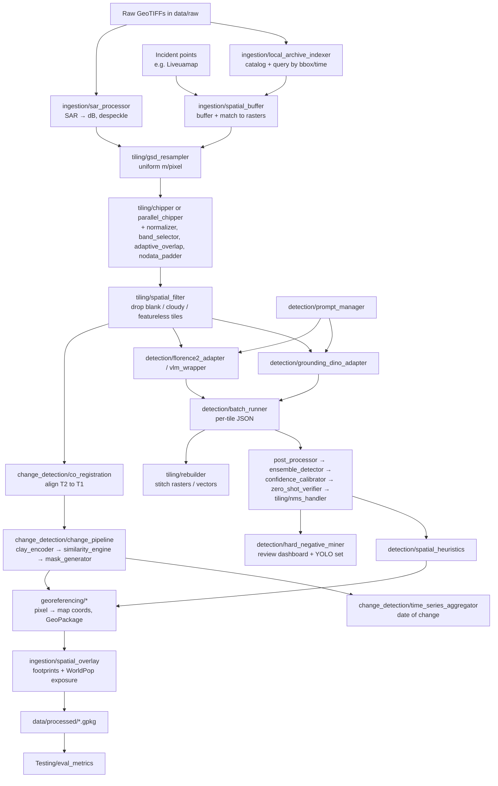

# Codebase Overview: `unitednations_remotesensing`

> **Status:** All code in this repository is untested according to the commit history. This document is based on reading the source code, not on running it. It describes what each script is *meant* to do, based on its docstrings, names and logic. Where the code clearly won't work as written, this is noted in [Known gaps](#11-known-gaps-observed-while-reading). Fixes applied on 2026-09-28 are listed in the [Change log](#13-change-log).

## 1. What this project is for

This is an **offline ("air-gapped") geospatial AI pipeline**. It is meant to analyse very-high-resolution commercial satellite imagery for humanitarian and conflict monitoring. Nearly every module says it follows an "Air-Gapped Workstation Standard": all model weights and data are loaded from local folders (`models/`, `data/`), and nothing is downloaded at runtime. This suggests the imagery is sensitive or licensed and must be processed on an isolated GPU workstation, such as an RTX 4090 or A6000 (the GPUs named in `config.py`).

The workflow the code supports is:

1. **Find imagery for an incident.** Index a local archive of satellite scenes (Vantor/Maxar, Airbus Pléiades/SPOT, Capella SAR). Then match scenes to geolocated incident reports, for example from Liveuamap.
2. **Prepare the imagery.** Calibrate SAR, resample to a common resolution, pick RGB bands and cut large scenes into tiles.
3. **Detect objects with open-vocabulary vision-language models (VLMs).** Microsoft **Florence-2** and **Grounding DINO** are prompted with plain-language targets such as *tents, trench lines, damaged buildings, military vehicles, guard towers, aircraft* and *emergency assets*.
4. **Detect change over time with a geospatial foundation model.** **Clay** embeddings of pre-event (T1) and post-event (T2) imagery are compared. Places where the embeddings differ become change polygons with severity levels.
5. **Clean up the results.** Remove duplicates across tile seams, combine results from multiple models, calibrate scores, apply spatial logic (for example, no tents on water) and send uncertain cases for human review.
6. **Georeference and export the results.** Convert pixel boxes to map coordinates and write GeoPackages for GIS tools (QGIS/ArcGIS).
7. **Add context and evaluate.** Overlay building footprints and WorldPop population to estimate who is exposed. Score detections against ground truth (precision/recall/F1/mAP).

The target list (refugee tents, trench lines, bomb damage, military compounds) and the example coordinates (Tripoli, Libya, and Caracas, Venezuela) point to UN work on **situational awareness, damage assessment and displacement monitoring** in conflict and crisis zones.

## 2. Intended pipeline



## 3. Repository layout

```
unitednations_remotesensing/
├── .gitignore            # renamed from misspelled .gitingore on 2026-09-28
├── environment.yml       # conda env "remote-sensing-ai"
└── src/
    ├── config.py         # central paths, device, tiling defaults
    ├── init_env.py       # creates data/ and models/ folders
    ├── ingestion/        # finding, calibrating and matching raw imagery
    ├── tiling/           # resampling, band selection, chipping, filtering, NMS, stitching
    ├── detection/        # VLM adapters, prompts, post-processing, ensembling, verification
    ├── change_detection/ # Clay-embedding change detection and time series
    ├── georeferencing/   # pixel → map coordinates, CRS handling, vector export
    └── Testing/          # synthetic data generators and evaluation metrics
```

Folders created at runtime (and meant to stay out of git): `data/raw`, `data/interim`, `data/processed` and `models/{florence2, groundingdino, clayfoundation}`.

## 4. Root and configuration files

| File | Purpose |
|---|---|
| `.gitignore` *(was misspelled `.gitingore` until 2026-09-28)* | Keeps `data/` (sensitive imagery), `models/` (large weights), virtual environments, caches and OS files out of git. |
| `environment.yml` | Conda environment `remote-sensing-ai` (Python 3.10). Includes the geospatial stack (GDAL, rasterio, geopandas, pyproj, shapely, rioxarray), scientific Python, OpenCV/Pillow, **Streamlit** (a UI is planned but not written yet), and PyTorch plus Hugging Face `transformers`/`accelerate`/`timm`/`einops` for the VLMs. `requests`/`beautifulsoup4` are also listed, which suggests planned web scraping (such as Liveuamap) that doesn't exist yet. |
| `src/config.py` | Single source of truth for paths (`DATA_DIR`, `RAW_DIR`, `INTERIM_DIR`, `PROCESSED_DIR`, `MODELS_DIR` and one folder per model). It creates those folders on import, picks `DEVICE` (CUDA or CPU) and `TORCH_DTYPE` (bfloat16 on GPU), and sets tiling defaults: 512 px tiles with a 384 px stride, EPSG:4326 as fallback CRS, RGB band indices, and a 2–98 % contrast clip. Since 2026-09-28 it also defines the chipper and output settings: `DEFAULT_PADDING_MODE`, `DEFAULT_FILL_VALUE`, `MANIFEST_FILENAME`, `TILE_NAMING_SCHEMA` and `DEFAULT_OVERWRITE` (see [Change log](#13-change-log)). |
| `src/init_env.py` | Small script that checks for the data and model folders, creates any that are missing, and prints each one. |

## 5. `src/ingestion/` — Getting the right imagery in

| Script | What it's meant to do |
|---|---|
| `local_archive_indexer.py` | **`LocalArchiveIndexer`** scans `data/raw` for GeoTIFFs using multiple threads. For each file it reads the footprint (reprojected to WGS84), band count, size, resolution and CRS. It works out the **acquisition time** from sidecar JSON/XML, then TIFF tags, then the filename, and falls back to the file's modified time. It guesses the **vendor and sensor type** (Capella → SAR; Airbus/Pléiades/SPOT → optical; Maxar/WorldView/GEGD/Vantor → optical). The catalogue can be exported as **GeoJSON** or a **SQLite** table. `query_buffer()` returns scenes that cross a bounding box within a time window, filtered by modality and sorted by % coverage. |
| `sar_processor.py` | **`SARProcessor`** prepares SAR scenes (Capella, ICEYE). It converts digital numbers to backscatter in **dB** (clipped to −30…+5 dB) and reduces **speckle** with a median or Gaussian filter. For dual-pol data it also computes a **polarisation-ratio** band, which helps tell tents and camps (volume scattering) apart from buildings (double-bounce). Output is `<name>_calibrated_db.tif` in `data/interim`. |
| `spatial_buffer.py` | **`SpatialBufferEngine`** turns incident **points** (lon/lat, e.g. from Liveuamap) into square buffers measured in **metres**, using the local UTM zone (default 1 km). It scans `data/raw` for raster footprints and finds which rasters each buffer overlaps. It then calculates the exact **pixel window** to cut out, producing an extraction list for the chipper. |
| `spatial_overlay.py` | **`SpatialOverlayEngine`** adds context to detection or change polygons. `filter_by_building_footprints()` keeps only predictions that overlap a building footprint layer (for example Microsoft Buildings, stored in `data/raw/context/building_footprints.gpkg`) to remove non-structural false positives. `estimate_population_exposure()` sums **WorldPop** population inside each polygon. `export_contextual_layer()` writes a GeoPackage to `data/processed`. The docstring places this file in `georeferencing/`, but it actually sits in `ingestion/`. |

## 6. `src/tiling/` — Preparing images for the models

| Script | What it's meant to do |
|---|---|
| `gsd_resampler.py` | **`GSDResampler`** resamples a raster to one **ground sample distance (GSD)** (default 0.5 m/pixel), so a tent covers roughly the same number of pixels no matter which satellite captured it. It skips rasters already within tolerance and converts degrees to metres for geographic CRSs. |
| `band_selector.py` | **`BandSelector`** turns 4-band, 8-band or SAR rasters into **8-bit, 3-channel RGB** for VLM input. It applies a 2–98 % contrast stretch, handles single-band SAR (converted to dB, reduced with a simplified Lee filter, then copied into three channels) and offers optional Brovey **pan-sharpening**. |
| `adaptive_overlap.py` *(renamed from `adaptive_overlay.py` on 2026-09-28)* | **`AdaptiveOverlapCalculator`** picks the tile **stride and overlap** based on target shape. Linear targets such as trenches get 50 % overlap, clusters such as tent camps 35 %, and discrete objects such as vehicles 20 %. It can also set overlap as a fixed distance in metres using the GSD, estimate how likely an object is to be cut in half at a tile seam, and generate the full window grid (with edge adjustment). |
| `nodata_padder.py` | **`NoDataPadder`** pads partial edge tiles up to the full tile size (reflect, edge or constant mode) and returns a **validity mask**. `crop_valid_region()` cuts predictions back to the real, unpadded area. |
| `normalizer.py` *(was an empty `Normalizer.py`; renamed and implemented on 2026-09-28)* | **`ArrayNormalizer`** turns a raw tile of shape (bands, height, width) into 8-bit, 3-channel RGB for the VLMs. It picks the bands in `config.DEFAULT_RGB_BANDS` (a single band is copied into all three channels) and applies a contrast stretch using `config.DEFAULT_CLIP_PERCENTILE`. NoData pixels are left out of the stretch and written as 0. The stretch is calculated **per tile**, so brightness can differ slightly between neighbouring tiles. `chipper.py` uses this class. |
| `chipper.py` | **`RasterChipper`** is the main "simple" tiler. It reads the GeoTIFF block by block, **skips all-NoData blocks**, normalises and pads each tile, computes each tile's georeferencing, writes it to `data/interim` using threads, and writes a **JSON manifest** (source raster, CRS, tile size, and per tile: filename, grid row/col, pixel window, padding, map bounds and geotransform). The detection runner, rebuilder and vector writer all read this manifest. |
| `parallel_chipper.py` | **`ParallelChipper`** is a faster alternative that uses multiple processes. It combines `AdaptiveOverlapCalculator` (stride based on target type), `BandSelector`, `NoDataPadder` and `TileIndexer`. It writes `tile_<col>_<row>.tif` files and a list-style manifest called `chip_extraction_manifest.json` to `data/processed`. |
| `tile_indexer.py` | **`TileIndexer`** keeps tile footprints in memory with a Shapely **STRtree** spatial index. It can find which tiles cover a given point, for example to answer "which tiles show this incident?". It can also export the tile grid as a GeoPackage or GeoJSON for checking in GIS. |
| `spatial_filter.py` | **`SpatialTileFilter`** runs before inference to **save GPU time**. It drops tiles with too much NoData (< 50 % valid pixels), too much bright cloud (> 60 %), or **low Shannon entropy** (featureless desert or water). Rejection reasons go to `data/processed/tile_rejection_manifest.json`. |
| `nms_handler.py` | **`TiledNMSHandler`** removes duplicate boxes after inference, where overlapping tiles detected the same object. It uses GPU `batched_nms` (per class or across classes), an optional **Soft-NMS**, and **lowers the score of boxes touching tile edges** so a partly cut-off object doesn't beat the complete one from the neighbouring tile. It works directly on detection DataFrames. |
| `rebuilder.py` | **`RasterRebuilder`** reverses chipping. `rebuild_raster()` stitches processed tiles (heatmaps or masks) back into one georeferenced GeoTIFF with overviews. `rebuild_vectors()` reads each tile's VLM JSON output, converts the pixel boxes to map coordinates using the tile geotransform from the manifest, and writes a single GeoPackage. |

## 7. `src/detection/` — Object detection with VLMs

| Script | What it's meant to do |
|---|---|
| `prompt_manager.py` | **`PromptManager`** plus `DEFAULT_TARGET_CATALOG`: the **domain vocabulary**. It defines eight target types (`tents`, `trenchlines`, `damaged_buildings`, `aircraft`, `military_compounds`, `guard_towers`, `military_vehicles`, `emergency_assets`). Each has a main prompt, synonyms, and box/text confidence thresholds tuned for that target. It formats prompts for Florence-2 (task token + text) and Grounding DINO (terms separated by `" . "`). The catalogue can be edited at runtime and saved to JSON. |
| `grounding_dino_adapter.py` | **`GroundingDINOAdapter`** loads Grounding DINO from `models/groundingdino` (local files only). It accepts a file path, array or PIL image, builds the prompt from the catalogue (including synonyms and each target's thresholds), and returns `[{bbox, label, confidence}]` in tile pixel coordinates. This is the output format `batch_runner` and `rebuilder` expect. |
| `florence2_adapter.py` | **`Florence2Adapter`** loads Florence-2 from `models/florence2` and runs `<OPEN_VOCABULARY_DETECTION>` (or other task prompts) on one tile or a batch. It returns a **DataFrame** with columns xmin…ymax, label and confidence, shifted by the tile's offset. Florence-2 doesn't produce confidence scores, so every box gets a **fixed 0.85**. Since 2026-09-28 it also has a standard `predict(image_data, targets)` method: target keys are turned into prompts through `PromptManager` and results come back as `[{bbox, label, confidence}]`, so it can be used with `BatchInferenceRunner`. |
| `vlm_wrapper.py` | **`LocalVLMWrapper`** is a generic, step-by-step wrapper for a local causal-LM VLM (Florence-2-style `<CAPTION_TO_PHRASE>` phrase grounding): load weights → turn input into a PIL image → format the prompt → run inference → return `[{bbox, label, confidence=1.0}]`. It overlaps with `florence2_adapter.py` and looks like an earlier or alternative version of it. **On 2026-09-28 the `predict` signature changed** from `predict(image, text_query)` to `predict(image_data, targets, task_prefix=..., **kwargs)`. It now loads the image itself from a path, array or PIL image. |
| `batch_runner.py` | **`BatchInferenceRunner`** runs any adapter with a `predict(image_data, targets, **kw)` method over every tile listed in a chipper manifest (or over a folder). It writes **one JSON file per tile** to `data/interim/vlm_results`, skips tiles already processed (unless `config.DEFAULT_OVERWRITE = True`), and clears GPU memory every N tiles. All three adapters now follow this interface ([Change log](#13-change-log)). |
| `post_processor.py` | **`VLMPostProcessor`** cleans raw detections. It maps varied labels to standard class names, applies per-class confidence thresholds, converts [0,1] coordinates to pixels, and removes boxes with unrealistic area or aspect ratio. |
| `ensemble_detector.py` | **`EnsembleDetector`** merges predictions from several models (default weights: Florence-2 1.0, Grounding DINO 1.2) using **Weighted Box Fusion**. It averages overlapping boxes rather than discarding the weaker ones, and **raises the score when different models agree**. Output includes `consensus_models` and `ensemble_method` columns. |
| `confidence_calibrator.py` | **`ConfidenceCalibrator`** fits **Platt scaling** to validation results so raw VLM scores become meaningful probabilities, and saves the result to `models/calibration/vlm_calibration_profile.json`. It also offers length normalisation for Florence-2 sequence log-likelihoods and a **density discount** that lowers scores in suspiciously dense clusters of detections. |
| `zero_shot_verifier.py` | **`ZeroShotVerifier`** double-checks candidates. It crops each detected box, rejects crops with no texture, embeds the crop with a ResNet-50 backbone and compares it to **class prototypes**: example images stored in `models/prototypes/<class>/*.jpg`. The final score blends the VLM score and the prototype similarity (`α·S_vlm + (1−α)·S_verify`). |
| `spatial_heuristics.py` | **`SpatialHeuristicsEngine`** removes detections that break geographic rules. Land-only classes on a **water mask** are dropped. Targets must be within a set distance of a related "anchor" (for example, vehicles near a compound). **Trench segments** must connect to at least one other segment (checked with a networkx graph). Detections must have a **realistic physical size** in m² for their class, given the GSD. |
| `hard_negative_miner.py` | **`HardNegativeMiner`** supports human review and later retraining. It pulls out **uncertain** detections (confidence 0.25–0.40), flags **isolated** detections with Local Outlier Factor, saves crops plus placeholder YOLO labels to `data/processed/audit/`, and builds a simple **HTML gallery** for analysts to review. |

## 8. `src/change_detection/` — Detecting change over time

| Script | What it's meant to do |
|---|---|
| `__init__.py` | Makes `ClayEncoder`, `LatentSimilarityEngine`, `ChangeMaskGenerator` and `ChangeDetectionPipeline` importable from the package. |
| `co_registration.py` | **`SpatialCoRegistrator`** aligns the post-event (T2) raster to the pre-event (T1) raster using OpenCV **ECC** (Euclidean motion: shift and rotation). Small misalignments from satellite angle or orbit would otherwise show up as false "change". If alignment fails it leaves the image unchanged, then writes the aligned T2 GeoTIFF. |
| `clay_encoder.py` | **`ClayEncoder`** is meant to load the **Clay geospatial foundation model** (`models/clayfoundation/clay_v1.pth`). It produces unit-length (L2-normalised) embeddings: one vector per tile (`extract_features`) or a grid of patch embeddings (`extract_spatial_embedding_map`). If the weights file is missing it falls back to an untrained ResNet-50 so the code can still run. |
| `similarity_engine.py` | **`LatentSimilarityEngine`** compares T1 and T2 embeddings (cosine, Euclidean or Manhattan) instead of subtracting raw pixels. It produces a **change map** where 0 means identical and 1 means completely changed. `apply_local_variance_normalization()` damps broad, uniform shifts (lighting, season) so localised change stands out. |
| `mask_generator.py` | **`ChangeMaskGenerator`** turns the change map into a yes/no change mask. The threshold is either calculated automatically (**Otsu**) or fixed at 0.45. It removes speckle noise (morphological open/close), sorts change into **severity levels** (none / minor / moderate / severe at 0.30 / 0.50 / 0.70), and converts the mask to polygons labelled `change_severity_N`. |
| `change_pipeline.py` | **`ChangeDetectionPipeline`** is the end-to-end runner. For each T1/T2 tile pair it checks the sizes match, then runs encode → change map → normalise → polygons. It joins the results, converts them to map coordinates (EPSG:4326) using the source raster, and writes `change_summary_manifest.json` with counts by severity. |
| `time_series_aggregator.py` | **`TimeSeriesAggregator`** handles a **dated series** of images of the same site. It compares each image's embedding to the first (baseline) image and marks it `intact` or `altered/destroyed` (similarity below 0.85). `identify_event_window()` reports **between which two dates** the change happened. |

## 9. `src/georeferencing/` — Pixel coordinates to map coordinates

| Script | What it's meant to do |
|---|---|
| `coord_transformer.py` | **`CoordinateTransformer`** (DataFrame version, used by `change_pipeline`). It caches each raster's geotransform and CRS, converts pixel boxes to four-corner polygons, and returns a GeoDataFrame reprojected to a target CRS. |
| `coordinate_transformer.py` | A **second class also called `CoordinateTransformer`** (list-of-dicts version). It takes a single source raster, adds each tile's offset to local boxes, and returns spatial bounding tuples plus the CRS. It does the same job as `coord_transformer.py` with a different API. |
| `crs_manager.py` | **`CRSManager`** makes projections consistent across sources. It reprojects GeoDataFrames (assuming EPSG:4326 if no CRS is set), reads a raster's CRS, and reprojects individual Shapely geometries. |
| `vector_writer.py` | **`VectorWriter`** is the final export step for VLM detections. It reads the chipper manifest, attaches each tile's geotransform and CRS to its boxes, and converts them to map polygons. Countable objects (tent, aircraft, vehicle) become **points** and infrastructure (trenches, compounds) stays as **polygons**. It then removes duplicates with **geographic NMS**, adds `prompt_used`, `acquisition_date` and source provenance, and writes `data/processed/detections.gpkg`. |

## 10. `src/Testing/` — Test data and evaluation

| Script | What it's meant to do |
|---|---|
| `create_synthetic_tiff.py` | Writes a 2048×2048, 3-band random-noise GeoTIFF located over **Tripoli, Libya** (EPSG:4326). The bottom-right corner is set to NoData so blank-tile skipping can be tested. Output goes to `data/raw/synthetic_pipeline_test.tif`. |
| `generate_mock_data.py` | Same idea (`data/raw/test_image.tif`), with configurable size, band count and block size. |
| `eval_metrics.py` | **`SpatialEvalMetrics`** compares detections to ground truth. It matches predictions one-to-one with the **Hungarian algorithm** (so no box is counted twice), then computes precision, recall, F1, an approximate mAP@50 and mAP@50:95, and total-area bias. `evaluate_pipeline_output()` returns a table with one row per class. |

## 11. Known gaps observed while reading

The repo is described as untested, so this section lists problems found just by reading. These are things that would stop code from importing or running, or that would give misleading results. It is meant as a checklist, not a full review.

Items marked ✅ were fixed on 2026-09-28 (see [Change log](#13-change-log)). Everything else is still open.

**Things that would stop code from running**
- ✅ **`.gitingore` was misspelled**, so git ignored it and `data/` (sensitive imagery) and `models/` were not excluded from commits. It has been renamed to `.gitignore`.
- ✅ **`config.py` was missing settings other modules use:** `DEFAULT_PADDING_MODE`, `DEFAULT_FILL_VALUE`, `MANIFEST_FILENAME`, `TILE_NAMING_SCHEMA` and `DEFAULT_OVERWRITE`.
- ✅ **`tiling/chipper.py`** had a syntax error in `chip_raster` (`-> Path:4` and broken indentation), and its `ArrayNormalizer` import pointed at an empty, differently capitalised `Normalizer.py`.
- ✅ **`tiling/parallel_chipper.py`** imported `src.tiling.adaptive_overlap`, but the file was called `adaptive_overlay.py`.
- ✅ **`change_detection/mask_generator.py`** imported `Shape` from `shapely.geometry`, which doesn't exist, so the whole `change_detection` package failed to import.
- ✅ **`detection/confidence_calibrator.py`** used `Tuple` without importing it.
- ✅ **`georeferencing/vector_writer.py`** used `Polygon`, `Affine` and `gpd` without importing them.
- ✅ **`environment.yml`** didn't list `scikit-learn` or `rasterstats`.
- ✅ Runtime crashes: an invalid `offset='dr'` in `coordinate_transformer.py`; a boolean mask passed to `rasterio.features.shapes` in `mask_generator.py`; a missing `import rasterio.features` in `spatial_buffer.py`; comparing naive and timezone-aware dates in `local_archive_indexer.query_buffer`; and the `transformers` rename of `box_threshold` → `threshold` in `grounding_dino_adapter.py`.
- ⚠️ Docstrings containing LaTeX (`\frac`, `\text`, `\alpha`) are not raw strings. The formulas display garbled, and newer Python versions give `SyntaxWarning`s. *(Still open; cosmetic.)*
- Imports are inconsistent. Most modules use `from src import config` (so they must be run from the repo root, e.g. `python -m src...`), but `init_env.py` and `create_synthetic_tiff.py` use `import config`. `src/`, `src/tiling/` and `src/Testing/` have no `__init__.py`, and the other `__init__.py` files are mostly empty.

**Parts that don't fit together**
- **Two manifest formats.** `chipper.py` writes a dict with a `tiles` list keyed by `filename`/`window`/`padding`/`transform`. `parallel_chipper.py` writes a plain list keyed by `tile_path`/`bounds`. `batch_runner`, `rebuilder` and `vector_writer` only understand the `chipper.py` format. Also, `chipper.py` tiles by the GeoTIFF's internal blocks, so its tiles **don't overlap** and ignore `DEFAULT_STRIDE`.
- ✅ **The adapters had different interfaces.** `batch_runner` calls `adapter.predict(image_data=..., targets=...)`, and only `GroundingDINOAdapter` matched that. `Florence2Adapter` and `LocalVLMWrapper` now match it too.
- ⚠️ `LocalVLMWrapper` and `PromptManager.format_for_florence2` default to the task token `<CAPTION_TO_PHRASE>`. Florence-2's actual phrase-grounding token is `<CAPTION_TO_PHRASE_GROUNDING>`, so this should be checked against the model version you use. *(Still open.)*
- **Two `CoordinateTransformer` classes** with the same name and different APIs live in the same package.
- **Florence-2 confidences are made up** (0.85 or 1.0). Calibration, ensembling, uncertainty mining and the confidence filtering in post-processing therefore can't tell good Florence-2 boxes from bad ones.

**Places where results would be misleading**
- **`clay_encoder.py` doesn't use Clay yet.** Without `clay_v1.pth` it calls `torch.hub.load(...)`, which needs the internet and breaks the air-gapped rule. It then uses an **untrained** ResNet-50. That backbone outputs one flat vector, so the "spatial" change map becomes a single 1×1 cell. The real Clay model is a multispectral ViT with its own input format (bands, wavelengths, GSD, time) and is not called this way.
- **`sar_processor.generate_pol_ratio`** divides two **dB** values. In dB a ratio should be a subtraction, or it should be computed in linear units.
- **`local_archive_indexer`** treats the TIFF tag `AREA_OR_POINT` as a timestamp. It also records `gsd_meters` in the raster's own units, which are degrees for EPSG:4326.
- **`generate_mock_data.py`** puts UTM-style metre coordinates (300000, 4200000) under an EPSG:4326 (degrees) CRS, so the test file's location is invalid.
- **`eval_metrics` mAP** is estimated as precision × recall, not a true area under the precision–recall curve.
- **`tile_indexer.export_tile_manifest`** labels the area as `area_sqm`, but the CRS is EPSG:4326, so the value is actually in square degrees.
- **`gsd_resampler`** converts degrees to metres with 111,320 m for both axes, which ignores that longitude spacing shrinks with latitude.
- **`hard_negative_miner`** writes a fixed placeholder YOLO box for every crop. The HTML dashboard looks for an `image_id` column that nothing creates.

## 12. Suggested order for getting it running

1. ✅ *Done 2026-09-28: `.gitingore` renamed to `.gitignore`; missing `config.py` settings added; `scikit-learn` and `rasterstats` added to the environment.*
2. ✅ *Done 2026-09-28: import-time errors fixed and `ArrayNormalizer` implemented.*
3. Pick **one** chipper and **one** manifest format. Pick **one** `CoordinateTransformer`. ✅ *Done 2026-09-28: all adapters share the `predict(image_data, targets, **kw) -> [{bbox, label, confidence}]` interface.*
4. Test the smallest end-to-end path on synthetic data: `create_synthetic_tiff` → `chipper` → `spatial_filter` → `batch_runner` (Grounding DINO) → `rebuilder.rebuild_vectors`/`vector_writer` → open the GeoPackage in QGIS.
5. Then add change detection with real Clay weights, and the enrichment, verification and evaluation steps.

## 13. Change log

### 2026-09-28 — Syntax, import and runtime fixes (Claude Code, for charliefp03-dg)

Every code change is marked in the source with a comment containing the tag below. To find all of them (or delete them later), search for it:

```
[EDIT 2026-09-28 | Claude Code for charliefp03-dg]
```

These fixes make every module compile and import (checked with Python's parser and pyflakes). **No module was run against real data or models.**

#### Changes that affect how the project is used

| Change | What it means for users and other code |
|---|---|
| **File renamed:** `.gitingore` → `.gitignore` | Git now actually applies the ignore rules: `data/` (imagery), `models/` (weights), virtual environments, `__pycache__/` and OS files are no longer picked up by `git add`. Files that are already tracked are unaffected (none were). |
| **File renamed:** `src/tiling/adaptive_overlay.py` → `src/tiling/adaptive_overlap.py` | Import it as `from src.tiling.adaptive_overlap import AdaptiveOverlapCalculator`. The old name no longer exists. |
| **File renamed and implemented:** `src/tiling/Normalizer.py` (empty) → `src/tiling/normalizer.py` containing `ArrayNormalizer` | `RasterChipper` now **writes 8-bit, 3-channel RGB tiles** (bands from `DEFAULT_RGB_BANDS`, contrast-stretched per tile with `DEFAULT_CLIP_PERCENTILE`). Tiles are no longer raw multi-band data, so anything that needs the original values (such as NIR or SAR dB) must read the source raster. |
| **New `config.py` settings** | `DEFAULT_PADDING_MODE = "constant"`, `DEFAULT_FILL_VALUE = 0`, `MANIFEST_FILENAME = "tile_manifest.json"`, `TILE_NAMING_SCHEMA = "{source_name}_r{row}_c{col}.tif"`, `DEFAULT_OVERWRITE = False`. These are sensible first choices, not settings the original author defined. Consequences: chipper tiles are named e.g. `scene_r0_c3.tif`; the chipper manifest is written to `data/interim/tile_manifest.json` and read from there by `VectorWriter`; **re-running the chipper or `BatchInferenceRunner` skips files that already exist** (set `DEFAULT_OVERWRITE = True` to regenerate them); edge tiles are padded with 0, which is also written as the tiles' NoData value. |
| **Environment:** `scikit-learn` and `rasterstats` added to `environment.yml` | Rebuild or update the conda environment: `conda env update -f environment.yml`. |
| **Adapter interface standardised** | Every detection adapter now supports `predict(image_data, targets, **kwargs) -> [{"bbox": [xmin, ymin, xmax, ymax], "label": str, "confidence": float}]`, so `BatchInferenceRunner` works with `GroundingDINOAdapter`, `Florence2Adapter` and `LocalVLMWrapper`. |
| **Breaking change:** `LocalVLMWrapper.predict` | Changed from `predict(image, text_query)` to `predict(image_data, targets, task_prefix="<CAPTION_TO_PHRASE>", **kwargs)`. It now accepts a path, array or PIL image and handles image loading itself. The task prefix is now passed through to output parsing instead of being hard-coded. |
| **New method:** `Florence2Adapter.predict` | Wraps `predict_tile()`. Target keys (e.g. `"tents"`) are turned into prompts using `PromptManager`'s catalogue. Existing `predict_tile()` / `predict_batch()` are unchanged. |
| **Date handling:** `LocalArchiveIndexer.query_buffer` | Start/end times and scene timestamps are all converted to UTC before comparing. A time given without a timezone (e.g. `"2024-01-01"`) is **treated as UTC**. |
| **transformers compatibility:** `GroundingDINOAdapter.predict` | Detects whether the installed `transformers` version expects `threshold` or `box_threshold`, so it works with both older and newer releases. |

#### Fixes that don't change how anything is used

- `tiling/chipper.py`: removed the stray `4` after `-> Path` and fixed the indentation of `chip_raster`.
- `change_detection/mask_generator.py`: removed the non-existent `Shape` import. The mask is now converted to `uint8` before `rasterio.features.shapes()`.
- `detection/confidence_calibrator.py`: added the missing `Tuple` import.
- `georeferencing/vector_writer.py`: added the missing `Polygon`, `Affine` and `geopandas` imports.
- `georeferencing/coordinate_transformer.py`: `offset='dr'` → `offset='lr'`.
- `ingestion/spatial_buffer.py`: added `import rasterio.features`.
- `detection/batch_runner.py`: docstring now documents the adapter interface (no code change).
